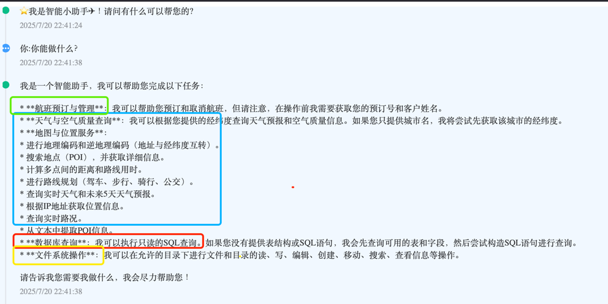

# Fight-Booking

本项目参考了[*spring-ai-examples*][1]，[*mcp For Client Developers*][5] 和 [*Google Cloud and Spring AI 1.0*][6]，此外，感谢 **徐庶** 老师的[分享][4]。

## 项目前提
1. 申请[*阿里百炼key*][2]  
2. 申请[*Google Gemini key*][3]

## 项目结构
> fight-booking     // 4. 后端，Spring Boot应用  
> flight-booking-app // 3. 前端, 运行 `npm run dev` 启动  
> mcp-server-sse    // 2. build, 作为MCP服务器，需预先启动  
> mcp-server-stdio // 1. build, 作为本地MCP服务器，无需预先启动  

## 功能介绍

---  
---  

[1]: https://github.com/spring-projects/spring-ai-examples
[2]: https://bailian.console.aliyun.com/?tab=model&spm=0.0.0.i1#/api-key
[3]: https://aistudio.google.com/apikey
[4]: https://www.yuque.com/geren-t8lyq/ncgl94/gwvu33ofgbrciqtb?singleDoc=
[5]: https://modelcontextprotocol.io/quickstart/client#java
[6]: https://cloud.google.com/blog/topics/developers-practitioners/google-cloud-and-spring-ai-10